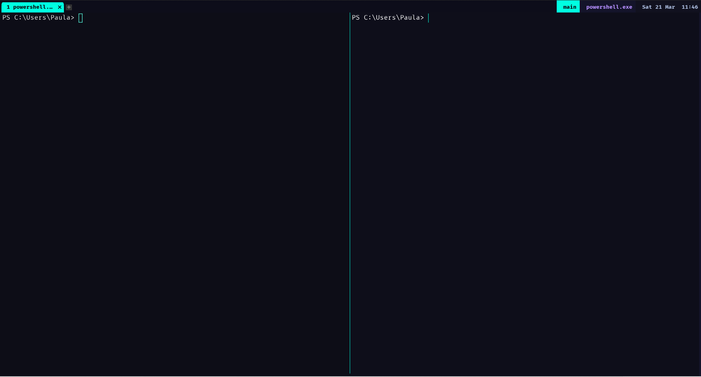
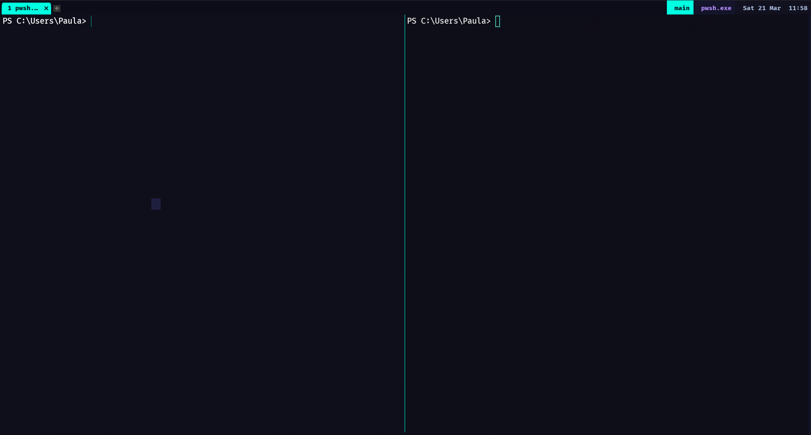

# WezTerm: The Best tmux Alternative for Windows

> **Replace tmux on Windows** with a GPU-accelerated, natively multiplexing terminal.
> Zero dependencies, one config file, works out of the box on Windows 10/11.

[](https://wezfurlong.org/wezterm/)
[](https://wezfurlong.org/wezterm/)
[](https://github.com/PowerShell/PowerShell)
[](https://github.com/ryanoasis/nerd-fonts)
[](LICENSE)

---

## What Is This?

If you use **tmux on Linux or macOS** and want the same experience on **Windows**, this repo gives you a fully configured [WezTerm](https://wezfurlong.org/wezterm/) setup that matches — and in many ways **exceeds** — tmux.

**No WSL required. No Cygwin. No extra tools. Just one PowerShell command.**

---

## One-Line Install

Open PowerShell (no admin needed) and run:

```powershell
irm https://raw.githubusercontent.com/Muminur/tmux-alternative-windows/main/install.ps1 | iex
```

This installs and configures **everything automatically**:

| Step | Component | What it does |
|------|-----------|-------------|
| 1 | **WezTerm** | GPU-accelerated terminal with built-in multiplexer |
| 2 | **PowerShell 7** | Modern shell with ANSI colour support |
| 3 | **FiraCode Nerd Font** | Programming font with ligatures + Nerd Font glyphs |
| 4 | **wezterm.lua** | Neon dark theme, tmux keybindings, 7-pane agent layout |
| 5 | **PS7 profile** | Neon prompt and syntax highlighting |

> **Requirement:** Windows 10/11 with `winget` (App Installer from the Microsoft Store)

---

## Screenshots

### 2-Pane Workspace — Neon Dark Theme



*Two PowerShell 7 panes side-by-side. Neon cyan split line. Status bar shows workspace name, active process, and clock. Opens automatically on WezTerm launch.*

### Status Bar Detail



*Right-side status bar: workspace indicator (cyan), active process name (purple), battery level, and live clock. Active tab highlighted in neon cyan.*

---

## Why WezTerm Instead of tmux on Windows?

tmux requires WSL or Cygwin on Windows — it is a Linux tool bolted onto Windows. WezTerm is a **native Windows application** built from scratch, with a full terminal multiplexer included.

| Feature | tmux via WSL | WezTerm native |
|---------|:---:|:---:|
| Pane splitting | Yes | Yes |
| Persistent sessions | Yes | Yes |
| Vim-style copy mode | Yes | Yes |
| Named workspaces / sessions | Yes | Yes |
| SSH remote sessions | Yes | Yes |
| GPU-accelerated rendering | No | **Yes** |
| Runs natively on Windows (no WSL) | No | **Yes** |
| Font ligatures | No | **Yes** |
| Lua scripting and automation | No | **Yes** |
| Window transparency and blur | No | **Yes** |
| One-command install | No | **Yes** |

---

## Keybinding Reference

The leader key is **CTRL+B** — same as the tmux default.

### Pane Management

| Keybinding | Action |
|-----------|--------|
| `LEADER + \|` or `%` | Split pane right (vertical divider) |
| `LEADER + -` or `"` | Split pane down (horizontal divider) |
| `LEADER + h/j/k/l` | Navigate panes (vim-style) |
| `LEADER + Arrow keys` | Navigate panes |
| `LEADER + H/J/K/L` | Resize pane by 5 cells |
| `LEADER + z` | Zoom pane fullscreen toggle |
| `LEADER + x` | Close current pane |
| `LEADER + o` | Visual pane picker |
| `LEADER + { / }` | Rotate panes |
| `LEADER + A` | **Spawn 7-pane agent layout** |

### Tabs (equivalent to tmux windows)

| Keybinding | Action |
|-----------|--------|
| `LEADER + c` | New tab |
| `LEADER + n / p` | Next / previous tab |
| `LEADER + 1–9` | Switch to tab by number |
| `LEADER + ,` | Rename tab |
| `LEADER + &` | Close tab |

### Workspaces (equivalent to tmux sessions)

| Keybinding | Action |
|-----------|--------|
| `LEADER + w` | Fuzzy workspace switcher |
| `LEADER + s` | Full launcher (workspaces + tabs + apps) |
| `LEADER + W` | Create new named workspace |
| `LEADER + $` | Rename current workspace |
| `LEADER + D` | Connect to SSH domain |

### Copy Mode — Vim Keybindings

Enter with `LEADER + [`, exit with `q` or `Esc`.

| Key | Action |
|-----|--------|
| `h/j/k/l` | Move cursor |
| `w / b / e` | Word forward / backward / end |
| `0 / $` | Start / end of line |
| `g / G` | Top / bottom of scrollback |
| `v` | Character selection |
| `V` | Line selection |
| `Ctrl+v` | Block/rectangle selection |
| `y` | Yank (copy) to clipboard and exit |
| `/` | Search forward |
| `n / N` | Next / previous match |
| `q` or `Esc` | Exit copy mode |

### Other Shortcuts

| Keybinding | Action |
|-----------|--------|
| `CTRL+Shift+C` | Copy to clipboard |
| `CTRL+Shift+V` | Paste from clipboard |
| Right-click | Paste (mouse shortcut) |
| `CTRL+click` | Open URL under cursor |
| `CTRL+=` / `CTRL+-` | Increase / decrease font size |
| `CTRL+0` | Reset font size |
| `LEADER + r` | Reload config without restart |
| `LEADER + f` | Search scrollback buffer |
| `LEADER + Space` | Quick select any text pattern |
| `LEADER + u` | Quick select URL and open in browser |
| `LEADER + ?` | Show all key assignments |

---

## 7-Pane Agent Layout

Press **LEADER + A** to expand the current tab into a 7-pane workspace — ideal for running multiple Claude Code agents in parallel:

```
+----------+----------+----------+----------+
|  Agent 1 |  Agent 2 |  Agent 3 |  Agent 4 |  <- top 60%
+----------+----------+----------+----------+
|  Agent 5 |  Agent 6 |       Agent 7       |  <- bottom 40%
+----------+----------+---------------------+
```

Each pane opens a PowerShell 7 session labelled Agent-1 through Agent-7. Other tabs and workspaces are untouched.

---

## Built-in Multiplexer (Persistent Sessions)

WezTerm includes a built-in session server — like `tmux new-session` but with nothing extra to install.

**Auto-attach is enabled by default.** WezTerm starts a persistent mux server on launch and reconnects to your existing `main` workspace automatically. On first launch it opens a 2-pane layout in the `main` workspace.

Connect manually from a new terminal window:

```powershell
wezterm connect mux
```

This also correctly initialises the `main` workspace with a 2-pane layout when the mux server starts fresh — whether you open WezTerm normally or run `wezterm connect mux` from an external terminal.

### Safely closing WezTerm (preserving your session)

| Action | What happens | Session preserved? |
|--------|-------------|-------------------|
| Close the WezTerm **window** (X button / Alt+F4) | GUI closes, mux server keeps running | ✅ Yes |
| Open WezTerm again | Auto-reconnects to running mux server, all panes intact | ✅ Yes |
| Say **Yes** to "kill all panes?" | Processes are killed, session is gone | ❌ No |
| `CTRL+D` in a shell | Exits that shell, closes that pane only | ❌ That pane |

**Rule of thumb:** To preserve your session, always close the WezTerm **window** — never say "yes" to killing panes. The mux server (`wezterm-mux-server.exe`) continues running in the background and your panes stay alive.

> **Note:** If you see `pane id 0 not found in mux` errors in the status bar after reconnecting, this is fixed in the current config — `get_foreground_process_name()` is now wrapped in `pcall()` so stale pane references after mux reconnect no longer crash the status bar.

To disable auto-attach and use WezTerm without the persistent mux, comment out this line in `wezterm.lua`:

```lua
config.default_gui_startup_args = { 'connect', 'mux' }
```

---

## SSH Domains

Add remote servers to `wezterm.lua` and connect with `LEADER + D`:

```lua
config.ssh_domains = {
  { name = 'dev',  remote_address = '10.0.0.10',        username = 'ubuntu' },
  { name = 'prod', remote_address = 'prod.example.com',  username = 'deploy' },
}
```

WezTerm also auto-reads `~/.ssh/config` — no extra setup for hosts already defined there.

---

## Theme: Neon Dark

| Element | Value |
|---------|-------|
| Background | `#0d0d1a` (near-black indigo) |
| Foreground | `#ffffff` (pure white) |
| Cyan accent | `#00ffe1` (splits, active tab) |
| Magenta | `#ff00aa` (leader key indicator) |
| Green | `#00ff88` |
| Yellow | `#ffe566` |
| Cursor | Blinking cyan bar |
| Backdrop | Windows Acrylic blur |
| Font | FiraCode Nerd Font Medium 14px |
| Ligatures | calt, clig, liga, ss01, ss03, ss05 |

---

## Manual Installation

### Step 1 — Install WezTerm

```powershell
winget install --id WezFurlong.WezTerm
```

### Step 2 — Install PowerShell 7

```powershell
winget install --id Microsoft.PowerShell
```

### Step 3 — Install FiraCode Nerd Font

Download `FiraCode.zip` from the [nerd-fonts releases page](https://github.com/ryanoasis/nerd-fonts/releases/tag/v3.3.0). Extract and install — no admin needed:

```powershell
$fontsDir = "$env:LOCALAPPDATA\Microsoft\Windows\Fonts"
$regPath  = "HKCU:\SOFTWARE\Microsoft\Windows NT\CurrentVersion\Fonts"
New-Item -Force -ItemType Directory $fontsDir | Out-Null
Get-ChildItem "$env:TEMP\FiraCode" -Filter *.ttf | ForEach-Object {
  $dst = Join-Path $fontsDir $_.Name
  Copy-Item $_.FullName $dst -Force
  Set-ItemProperty -Path $regPath -Name ($_.BaseName + " (TrueType)") -Value $dst
}
```

### Step 4 — Place the Config

```powershell
New-Item -ItemType Directory -Force "$env:USERPROFILE\.config\wezterm"
Invoke-WebRequest "https://raw.githubusercontent.com/Muminur/tmux-alternative-windows/main/wezterm.lua" `
  -OutFile "$env:USERPROFILE\.config\wezterm\wezterm.lua"
Copy-Item "$env:USERPROFILE\.config\wezterm\wezterm.lua" "$env:USERPROFILE\.wezterm.lua"
```

---

## Customising

The config lives at `~/.config/wezterm/wezterm.lua`. WezTerm hot-reloads on save — press `LEADER + r` to force reload.

```lua
config.font_size = 14.0                   -- font size
config.window_background_opacity = 0.97  -- 0.0 transparent, 1.0 solid
config.leader = { key = 'a', mods = 'CTRL' }  -- change leader key

-- Add SSH servers
config.ssh_domains = {
  { name = 'myserver', remote_address = '192.168.1.1', username = 'admin' },
}
```

---

## Troubleshooting

**Font shows boxes or question marks**

```powershell
wezterm ls-fonts --list-system | Select-String fira
```

If nothing appears, reinstall the font. The config falls back to JetBrainsMono, then Cascadia Code, then Consolas.

**Config not loading after install**

WezTerm reads `~/.config/wezterm/wezterm.lua` first, then `~/.wezterm.lua`. The installer writes both. If neither loads, fully quit WezTerm from the system tray and reopen.

**Error: "local is a built-in domain"**

Old config has `name = 'local'` in `unix_domains`. The current config uses `name = 'mux'`. Re-download `wezterm.lua` to fix.

**WSL errors in panes on startup**

The config defaults to PowerShell 7. If WSL is not installed, some launcher entries may error. Install WSL with:

```powershell
wsl --install
```

---

## Repository Structure

```
tmux-alternative-windows/
├── install.ps1                       # One-line installer script
├── wezterm.lua                       # Full WezTerm Lua config
├── Microsoft.PowerShell_profile.ps1  # Neon PS7 profile
├── screenshots/
│   ├── wezterm-2pane-neon.png        # 2-pane neon dark layout
│   └── wezterm-status-bar.png        # Status bar detail
└── README.md
```

---

## Contributing

Open an issue or pull request. Suggestions welcome for:

- Additional colour themes
- More SSH domain examples
- WSL integration improvements
- Extra keybinding configurations

---

## Related Links

- [WezTerm official documentation](https://wezfurlong.org/wezterm/)
- [WezTerm Lua API reference](https://wezfurlong.org/wezterm/config/lua/general.html)
- [FiraCode Nerd Font releases](https://github.com/ryanoasis/nerd-fonts/releases)
- [PowerShell 7 on GitHub](https://github.com/PowerShell/PowerShell)

---

## License

MIT — use freely, fork, and modify as you like.
