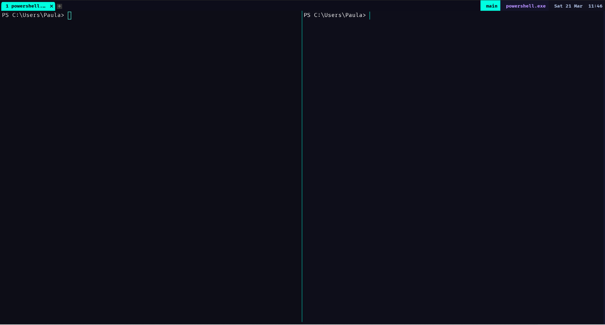
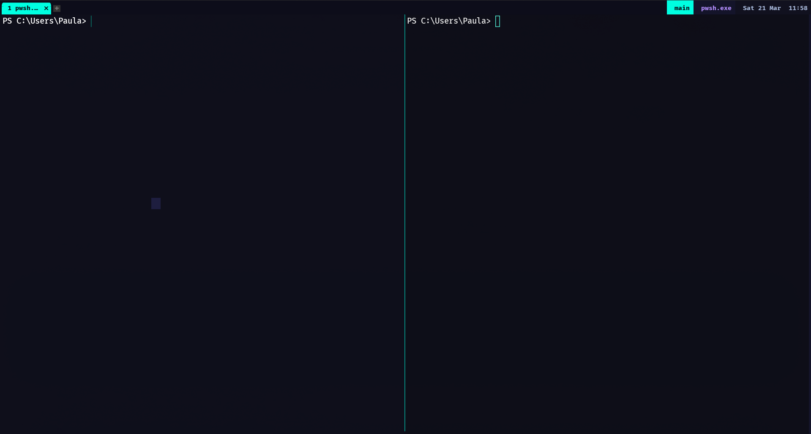

# WezTerm: The Best tmux Alternative for Windows

> **Replace tmux on Windows** with a GPU-accelerated, natively multiplexing terminal.
> Zero dependencies, one config file, works out of the box on Windows 10/11.

[](https://wezfurlong.org/wezterm/)
[](https://github.com/wezterm/wezterm/releases/tag/nightly)
[](https://github.com/PowerShell/PowerShell)
[](https://github.com/ryanoasis/nerd-fonts)
[](LICENSE)

---

## What Is This?

If you use **tmux on Linux or macOS** and want the same experience on **Windows**, this repo gives you a fully configured [WezTerm](https://wezfurlong.org/wezterm/) setup that matches — and in many ways **exceeds** — tmux.

**No WSL required. No Cygwin. No extra tools. Just one PowerShell command.**

---

## One-Line Install

Open PowerShell (no admin needed) and run:

```powershell
irm https://raw.githubusercontent.com/Muminur/tmux-alternative-windows/main/install.ps1 | iex
```

This installs and configures **everything automatically**:

| Step | Component | What it does |
|------|-----------|-------------|
| 1 | **WezTerm** | GPU-accelerated terminal with built-in multiplexer |
| 2 | **PowerShell 7** | Modern shell with ANSI colour support |
| 3 | **FiraCode Nerd Font** | Programming font with ligatures + Nerd Font glyphs |
| 4 | **wezterm.lua** | Neon dark theme, tmux keybindings, session save/restore |
| 5 | **PS7 profile** | Neon prompt and syntax highlighting |
| 6 | **zoxide** | Smart `cd` replacement with frecency-based directory jumping |
| 7 | **Starship** | Cross-shell prompt with git/language indicators |

> **Requirement:** Windows 10/11 with `winget` (App Installer from the Microsoft Store)

### Install flags

```powershell
# Only refresh config files — skip WezTerm/PS7/Font reinstall
irm .../install.ps1 | iex  # then add -Update

# Skip individual components
install.ps1 -SkipZoxide -SkipStarship -SkipFont

# Preview all steps without executing
install.ps1 -DryRun
```

| Flag | Effect |
|------|--------|
| `-Update` | Re-download `wezterm.lua` and PS profile only |
| `-SkipWezTerm` | Skip WezTerm install |
| `-SkipPS7` | Skip PowerShell 7 install |
| `-SkipFont` | Skip FiraCode Nerd Font install |
| `-SkipZoxide` | Skip zoxide install |
| `-SkipStarship` | Skip Starship install |
| `-DryRun` | Print all steps without executing |

---

## Screenshots

### 2-Pane Workspace — Neon Dark Theme



*Two PowerShell 7 panes side-by-side. Neon cyan split line. Status bar shows workspace name, active process, and clock. Opens automatically on WezTerm launch.*

### Status Bar Detail



*Right-side status bar: zoom indicator, workspace (cyan), pane count, process name (purple), git branch (yellow), battery, and live clock.*

---

## Why WezTerm Instead of tmux on Windows?

tmux requires WSL or Cygwin on Windows — it is a Linux tool bolted onto Windows. WezTerm is a **native Windows application** built from scratch, with a full terminal multiplexer included.

| Feature | tmux via WSL | WezTerm native |
|---------|:---:|:---:|
| Pane splitting | Yes | Yes |
| Persistent sessions | Yes | Yes |
| Named session save/restore | tmux-resurrect plugin | **Built-in** |
| Auto-save every 15 min | tmux-continuum plugin | **Built-in** |
| Vim-style copy mode | Yes | Yes |
| Named workspaces / sessions | Yes | Yes |
| SSH remote sessions | Yes | Yes |
| GPU-accelerated rendering | No | **Yes** |
| Runs natively on Windows (no WSL) | No | **Yes** |
| Font ligatures | No | **Yes** |
| Lua scripting and automation | No | **Yes** |
| Window transparency and blur | No | **Yes** |
| One-command install | No | **Yes** |
| Broadcast input to all panes | No | **Yes** |
| Zoom indicator in status bar | No | **Yes** |
| Git branch in status bar | No | **Yes** |
| Scrollbar with smart auto-hide | No | **Yes** |
| Dark/Light theme toggle | No | **Yes** |
| Command palette | No | **Yes** |
| Bell notification for background panes | No | **Yes** |
| Long-running command notification | No | **Yes** |
| Session auto-pruning | No | **Yes** |
| Alt+Arrow instant pane navigation | No | **Yes** |
| Tab reordering | No | **Yes** |
| Break pane out to new tab | No | **Yes** |
| Last-workspace toggle (like tmux L) | Yes | **Yes** |
| Pane resize mode (continuous) | Yes | **Yes** |
| Project workspace launcher | tmuxinator plugin | **Built-in** |
| CWD-aware tab titles (git repo root when in a repo) | No | **Yes** |
| Workspace index indicator [N/M] | No | **Yes** |
| Synchronized pane input (all panes at once) | tmux synchronize-panes | **Built-in** |
| Git dirty indicator in status bar (● / ✓) | No | **Yes** |
| SSH host auto-discovery from ~/.ssh/config | No | **Yes** |
| Pane focus history navigation (back/forward) | No | **Yes** |
| Per-workspace accent colors | No | **Yes** |
| Window opacity toggle (solid ↔ transparent) | No | **Yes** |
| Floating/scratch pane (quick-command overlay) | No | **Yes** |
| Per-process color coding in status bar | No | **Yes** |
| Workspace layout templates (save & reuse) | tmuxinator-like | **Built-in** |
| Smart split direction (auto horizontal/vertical) | No | **Yes** |
| Per-pane labels shown in status bar | No | **Yes** |
| Dead pane detection (DEAD badge on exit) | No | **Yes** |
| Last-pane toggle (alt-tab for panes) | No | **Yes** |
| Command output capture to clipboard | No | **Yes** |
| Session restore diff (toast with counts + invalid CWDs) | No | **Yes** |
| Workspace dashboard with tab/pane counts | No | **Yes** |
| Inactive pane dimming (subtle desaturation) | No | **Yes** |
| Safe paste (dangerous-pattern check before paste) | No | **Yes** |
| Near-instant tab title update on directory change | No | **Yes** |
| Split ratio memory per workspace | No | **Yes** |
| Workspace template restore picker | No | **Yes** |
| Pane output capture to log file | No | **Yes** |
| Window title shows workspace › tab › process | No | **Yes** |
| Fuzzy keybinding cheat sheet | No | **Yes** |
| Per-workspace background tint | No | **Yes** |
| Quick config edit (one keybinding) | No | **Yes** |
| Send command to specific pane without focus switch | No | **Yes** |
| Session uptime in status bar | No | **Yes** |
| Auto-close dead panes | No | **Yes** |
| Pane scroll lock (freeze view, process continues) | No | **Yes** |

---

## Session Save & Restore (tmux-resurrect / tmux-continuum)

This config implements the same session persistence policy as the popular tmux plugins — and extends it with **named sessions**:

| tmux plugin | WezTerm equivalent |
|------------|-------------------|
| `tmux-resurrect` — manual save/restore | `LEADER + Ctrl+S` / `LEADER + Ctrl+R` |
| `tmux-resurrect` — named sessions | `LEADER + Ctrl+N` / `LEADER + Ctrl+L` |
| `tmux-continuum` — auto-save every 15 min | Built-in auto-save timer |
| `tmux-continuum` — auto-restore on start | Auto-restores on WezTerm startup |

**What is saved:**
- All workspace names (equivalent to tmux sessions)
- Active workspace (restored on next launch)
- All tab titles (equivalent to tmux windows)
- All pane working directories
- Pane layout (split directions reconstructed from saved positions)

**Save files:** `%USERPROFILE%\.wezterm_sessions\`
- `last.json` — most recent auto/manual save
- `prev.json` — backup of previous save (one rollback slot)
- `<name>.json` — named sessions (auto-pruned to 20 most recent)

### Session Restore Diff

When a session is restored on startup or via `LEADER+Ctrl+R`, a toast notification shows a summary of what was recovered:

- Number of workspaces, tabs, and panes that were restored
- Count of pane working directories that no longer exist on disk (invalid CWDs), so you can spot broken paths immediately

This replaces the silent restore behaviour — you always know what came back and whether any directories need attention.

### Named Sessions

Named sessions let you maintain multiple independent workspace layouts — like separate tmux session collections for different projects.

```
LEADER + Ctrl+N  →  prompt for a name, saves to ~/.wezterm_sessions/<name>.json
LEADER + Ctrl+L  →  fuzzy-pick from saved names and restore
LEADER + Ctrl+D  →  fuzzy-pick from saved names and delete
```

### How it works

```
On startup:
  1. Check if ~/.wezterm_sessions/last.json exists → if yes, restore it
     (restores to the active workspace that was open when last saved)
  2. Otherwise → create default 'main' workspace with 2-pane layout

Every 15 minutes:
  Auto-save all workspaces to last.json

LEADER + Ctrl+S:
  Save immediately + show "SAVED" in status bar for 30 seconds

LEADER + Ctrl+R:
  Restore from last.json into current session (adds workspaces)
```

### Status bar indicators

The status bar is split into two sides:

**Left status** — workspace and mode indicators:

| Badge | Colour | Meaning |
|-------|--------|---------|
| Workspace name `[N/M]` | Accent (varies per workspace) | Current workspace + index/total; color is a hash of the workspace name |
| `WAIT` | Magenta | Leader key is active |
| `ZOOM` | Yellow | A pane is zoomed fullscreen |
| `RESIZE` | Orange | Resize mode active (h/j/k/l to resize, ESC to exit) |
| `SYNC` | Red | Sync input mode active — every prompt line is sent to all panes |
| `RO` | Red | Pane is marked read-only |
| `CAPTURED` | Blue | Pane output was just captured to file (auto-clears after 30 s) |
| `FREEZE` | Purple | Pane view is scroll-locked (process continues running) |
| `SAVED` | Green | Session was saved (shows for 30 s) |
| `⏱ Nm` | Orange | Session age 5–15 min since last save |
| `STALE` | Red | Session age >15 min since last save |
| `Np` | Yellow | Number of panes in active tab |
| `[label]` | Cyan | Custom pane label (set with `LEADER+.`; hidden when no label is set) |
| `DEAD` | Red | Active pane's process has exited |

**Right status** — contextual information:

| Badge | Colour | Meaning |
|-------|--------|---------|
| Uptime `↑Xh Ym` | Dim | Session uptime since WezTerm started |
| Process name | Color-coded by process | Foreground process — color varies: ssh=red, python=blue, node=green, docker=purple, cargo=orange, go=cyan, ruby=magenta, java=yellow; all others default to purple |
| Branch name + `✓`/`●` | Yellow + Green/Red | Git branch — green `✓` when clean, red `●` when dirty (uncommitted changes) |
| Battery | Green/Red | Battery level |
| Clock | Dim | Day, date, time |

---

## Keybinding Reference

The leader key is **CTRL+B** — same as the tmux default.

### Pane Management

| Keybinding | Action |
|-----------|--------|
| `LEADER + \|` or `%` | Split pane right (inherits cwd; uses remembered split ratio) |
| `LEADER + -` or `"` | Split pane down (inherits cwd; uses remembered split ratio) |
| `LEADER + Enter` | **Smart split** — auto-picks right or bottom based on pane dimensions |
| `LEADER + backtick` | **Floating/scratch pane** — toggle a 20% bottom split for quick commands; re-pressing closes it |
| `ALT + h/j/k/l` | **Navigate panes instantly (no leader)** |
| `ALT + Arrow keys` | **Navigate panes instantly (no leader)** |
| `LEADER + h/j/k/l` | Navigate panes (vim-style, with leader) |
| `LEADER + Arrow keys` | Navigate panes (with leader) |
| `LEADER + ;` | **Last-pane toggle** — jump to the previously active pane (like alt-tab for panes) |
| `LEADER + H/J/K/L` | Resize pane by 5 cells (one-shot) |
| `LEADER + Ctrl+H` | **Enter resize mode** (h/j/k/l continuous, ESC/q to exit) |
| `LEADER + Ctrl+Shift+R` | **Set split ratio** — prompt for a decimal (0.1–0.9) and remember it per workspace |
| `LEADER + z` | Zoom pane fullscreen toggle |
| `LEADER + x` | Close current pane |
| `LEADER + !` | **Break pane out to new tab** |
| `LEADER + .` | **Set pane label** — annotate the active pane; label appears in the status bar |
| `LEADER + o` | Visual pane picker with home-row letter labels (a/s/d/f/g/h/j/k/l) |
| `LEADER + { / }` | Rotate panes |
| `LEADER + R` | **Toggle read-only indicator** |
| `LEADER + Shift+F` | **Scroll lock** — freeze pane view (enters copy mode); process continues in background; press again to unfreeze |
| `LEADER + Ctrl+Q` | **Auto-close dead panes** — finds and closes all exited panes in the active tab |

### Layouts

| Keybinding | Layout | Use case |
|-----------|--------|----------|
| `LEADER + A` | 7-pane agent grid | Multi-agent (Claude Code etc.) |
| `LEADER + Shift+2` | 2-pane side-by-side | Code + Terminal |
| `LEADER + Shift+3` | 3-pane code layout | Editor + Tests + Logs |
| `LEADER + Shift+4` | 4-pane grid (2×2) | Quad parallel workflows |
| `LEADER + Shift+5` | Main + sidebar (70/30) | Editor + stacked side panes |

### Broadcast

| Keybinding | Action |
|-----------|--------|
| `LEADER + Ctrl+X` | Prompt for text and send it to **all panes** in the active tab (one-shot) |
| `LEADER + Ctrl+Y` | **Toggle sync input mode** — each line you type is sent to ALL panes continuously; empty line or `LEADER+Ctrl+Y` again exits |
| `LEADER + Shift+K` | **Send command to specific pane** — fuzzy-pick a pane, then enter a command; sent without switching focus |

Useful with the 7-pane agent layout: run the same setup command across all agents simultaneously.

**Sync mode vs. one-shot broadcast:** `LEADER+Ctrl+X` sends a single command. `LEADER+Ctrl+Y` enters a continuous loop — every prompt entry goes to all panes until you send an empty line. The status bar shows `SYNC` in red while sync mode is active. This is the tmux `synchronize-panes` equivalent.

### Tabs (equivalent to tmux windows)

| Keybinding | Action |
|-----------|--------|
| `LEADER + c` | New tab |
| `LEADER + n / p` | Next / previous tab |
| `LEADER + 1–9` | Switch to tab by number |
| `LEADER + < / >` | **Reorder tab left / right** |
| `LEADER + ,` | Rename tab |
| `LEADER + &` | Close tab |

### Workspaces (equivalent to tmux sessions)

| Keybinding | Action |
|-----------|--------|
| `LEADER + w` | Fuzzy workspace switcher |
| `LEADER + s` | Full launcher (workspaces + tabs + apps) |
| `LEADER + W` | **Workspace dashboard** — fuzzy list of all workspaces with tab and pane counts; active workspace is marked; select to switch |
| `LEADER + $` | Rename current workspace |
| `LEADER + B` | **Toggle last workspace** (like tmux prefix+L) |
| `LEADER + Ctrl+T` | **Save workspace template** — prompt for a name and save the current layout as a reusable template |
| `LEADER + Ctrl+Shift+T` | **Restore workspace template** — fuzzy-pick from saved templates and restore the layout |
| `LEADER + P` | **Project launcher** — fuzzy-pick from project dirs, spawn workspace |
| `ALT + 1–9` | **Switch to workspace by index (sorted A-Z)** |
| `LEADER + D` | Connect to SSH domain |
| `LEADER + Shift+S` | **Dynamic SSH host picker** — fuzzy-pick from `~/.ssh/config` Host entries; opens SSH in a split pane |
| `LEADER + d` | **Quit WezTerm** — closes the application (save session first with LEADER+Ctrl+S) |

### Session Save & Restore (tmux-resurrect style)

| Keybinding | Action |
|-----------|--------|
| `LEADER + Ctrl+S` | **Save session** — writes all workspaces/tabs/panes to disk |
| `LEADER + Ctrl+R` | **Restore session** — recreates workspaces from last save |
| `LEADER + Ctrl+B` | **Restore backup** — restores from the previous save (`prev.json`) |
| `LEADER + Ctrl+N` | **Save named session** — prompt for a name, save to `<name>.json` |
| `LEADER + Ctrl+L` | **List named sessions** — fuzzy-pick and restore a named session |
| `LEADER + Ctrl+D` | **Delete named session** — fuzzy-pick and delete a named session |

### Copy Mode — Vim Keybindings

Enter with `LEADER + [`, exit with `q` or `Esc`.

| Key | Action |
|-----|--------|
| `h/j/k/l` | Move cursor |
| `w / b / e` | Word forward / backward / end |
| `0 / ^` | Start of line / first non-blank |
| `$` | End of line |
| `H / M / L` | **Viewport top / middle / bottom** |
| `f / F` | **Jump forward / backward to char** |
| `t / T` | **Jump forward / backward till char** |
| `; / ,` | **Repeat / reverse last jump** |
| `g / G` | Top / bottom of scrollback |
| `v` | Character selection |
| `V` | Line selection |
| `Ctrl+v` | Block/rectangle selection |
| `y` | Yank (copy) to clipboard and exit |
| `/` | Search forward |
| `n / N` | Next / previous match |
| `q` or `Esc` | Exit copy mode |

### Other Shortcuts

| Keybinding | Action |
|-----------|--------|
| `CTRL+Shift+C` | Copy to clipboard |
| `CTRL+Shift+V` | Paste from clipboard |
| `LEADER + V` | **Safe paste** — checks clipboard for dangerous patterns (`rm -rf`, `DROP TABLE`, etc.) and prompts for confirmation before pasting |
| `LEADER + Shift+C` | **Capture viewport** — copies the full visible pane text to the clipboard |
| Right-click | Paste (mouse shortcut) |
| `CTRL+click` | Open URL under cursor |
| `CTRL+=` / `CTRL+-` | Increase / decrease font size |
| `CTRL+0` | Reset font size |
| `LEADER + :` | **Command palette** (search all actions) |
| `LEADER + Shift+T` | **Toggle NeonDark ↔ NeonLight theme** |
| `LEADER + Shift+O` | **Toggle window opacity** — switch between solid (1.0) and transparent (0.85 + Acrylic blur) |
| `ALT + [` | **Pane history back** — jump to previously focused pane (20-entry stack) |
| `ALT + ]` | **Pane history forward** — jump forward through pane history |
| `LEADER + r` | Reload config without restart |
| `LEADER + e` | Open current selection (or viewport) in `$EDITOR` |
| `LEADER + f` | Search scrollback buffer |
| `LEADER + Space` | Quick select any text pattern (URLs, file paths, git hashes, IPs, UUIDs, Docker container IDs) |
| `LEADER + u` | Quick select URL and open in browser |
| `LEADER + ?` | Show all key assignments |
| `LEADER + /` | **Keybinding cheat sheet** — fuzzy-searchable reference of all keybindings grouped by category |
| `LEADER + Ctrl+E` | **Quick config edit** — open `wezterm.lua` in your system editor |
| `LEADER + Shift+L` | **Capture pane output** — save viewport text to a timestamped log file |

### Tab Titles

Tab titles automatically show the **git repository root name** when inside a git repository, or the **CWD basename** otherwise. When running a named process (like `vim`, `node`, `python`), the process name is shown instead. This means all panes inside the same repo (even in subdirectories) share the repo name as their tab title, making multi-project workflows much easier to navigate visually.

Git info is cached for **5 seconds** per directory, so tab titles update within 5 seconds of changing into a new directory — near-instant without hammering `git` on every repaint. Shells that send the OSC 7 `cwd_notify` escape sequence trigger an immediate cache invalidation, making updates instantaneous.

---

## Layouts

### 7-Pane Agent Grid

Press **LEADER + A** to expand the current tab into a 7-pane workspace — ideal for running multiple Claude Code agents in parallel:

```
+----------+----------+----------+----------+
|  Agent 1 |  Agent 2 |  Agent 3 |  Agent 4 |  <- top 60%
+----------+----------+----------+----------+
|  Agent 5 |  Agent 6 |       Agent 7       |  <- bottom 40%
+----------+----------+---------------------+
```

Each pane opens a PowerShell 7 session labelled Agent-1 through Agent-7.

### 2-Pane Side-by-Side

Press **LEADER + Shift+2** — splits the current pane 50/50 horizontally:

```
+---------------------+---------------------+
|       Editor        |      Terminal       |
+---------------------+---------------------+
```

### 3-Pane Code Layout

Press **LEADER + Shift+3** — editor on the left, tests and logs stacked on the right:

```
+---------------------+----------+
|                     |  Tests   |
|       Editor        +----------+
|                     |   Logs   |
+---------------------+----------+
```

### 4-Pane Grid (2×2)

Press **LEADER + Shift+4** — equal 2×2 grid:

```
+---------------------+---------------------+
|      Top-Left       |      Top-Right      |
+---------------------+---------------------+
|     Bottom-Left     |    Bottom-Right     |
+---------------------+---------------------+
```

### Main + Sidebar

Press **LEADER + Shift+5** — large main pane on the left (70%), narrow sidebar on the right (30%) with two stacked panes:

```
+----------------------------------+----------+
|                                  | Sidebar  |
|             Main                 +----------+
|                                  | Sidebar  |
+----------------------------------+----------+
```

> **Note:** Layout shortcuts add panes to the current tab. Close unwanted panes with `LEADER + x`.

---

## Built-in Multiplexer (Persistent Sessions)

WezTerm includes a built-in workspace system for organising your terminal sessions. Session persistence is handled entirely through JSON save files — no external server required.

**Auto-restore is enabled by default.** On startup WezTerm checks for `~/.wezterm_sessions/last.json` and restores your workspace layout automatically.

### Safely closing WezTerm (preserving your session)

| Action | What happens | Session preserved? |
|--------|-------------|-------------------|
| Close the WezTerm **window** (X button / Alt+F4) | WezTerm exits completely | Only if saved to disk |
| Open WezTerm again | Auto-restores from last save file | Yes (from last auto-save or manual save) |
| Say **Yes** to "kill all panes?" | Processes are killed, session is gone | No |
| `CTRL+D` in a shell | Exits that shell, closes that pane only | That pane lost |

**Rule of thumb:** Press `LEADER + Ctrl+S` before closing WezTerm to make sure your workspace layout is saved. Auto-save runs every 15 minutes, but a manual save guarantees nothing is lost.

### Session Persistence FAQ

**Q: What does LEADER+Ctrl+S save?**

It saves all workspace names, the active workspace, tab titles, and pane working directories to `%USERPROFILE%\.wezterm_sessions\last.json`. On the next startup (or when you press LEADER+Ctrl+R), WezTerm recreates those workspaces and opens panes in the correct directories.

**Q: Does it save running processes?**

No — terminal output and running processes are not saved. This matches the behaviour of tmux-resurrect. Your shell restarts fresh in the correct working directory.

**Q: How often does auto-save run?**

Every 15 minutes, matching tmux-continuum's default interval. The green **SAVED** badge in the status bar confirms each save. To change the interval, edit `AUTOSAVE_SECS` in `wezterm.lua`.

**Q: What is `prev.json` and how do I restore from it?**

Every time a save runs (manual or auto), the previous `last.json` is renamed to `prev.json` before being replaced. Press `LEADER + Ctrl+B` to restore from it. Named sessions are not affected by this rotation.

**Q: How do named sessions differ from the main save slot?**

Named sessions (`LEADER + Ctrl+N`) write to a separate `<name>.json` file and never overwrite `last.json` or `prev.json`. They are auto-pruned to the 20 most recent when a new named session is saved. Use them for project-specific layouts you want to keep.

**Q: How do I get notifications when a background command finishes?**

**Option 1 — Long-running command notification (recommended):** Add this to your `$PROFILE`. WezTerm will toast-notify when any command that took >15 seconds finishes in a non-focused pane:

```powershell
function prompt {
    $duration = if ($global:__wez_cmd_start) {
        ((Get-Date) - $global:__wez_cmd_start).TotalSeconds
    } else { 0 }
    if ($duration -gt 0) {
        [Console]::Write("`e]1337;SetUserVar=cmd_duration=$([Convert]::ToBase64String([Text.Encoding]::UTF8.GetBytes([int]$duration)))`a")
    }
    $global:__wez_cmd_start = Get-Date
    "PS $($PWD.Path)> "
}
```

**Option 2 — Bell notification:** Add a bell character to your prompt for a notification on every command completion in unfocused panes:

```powershell
function prompt { [char]7 + "PS $($PWD.Path)> " }
```

**Q: I closed WezTerm and my terminal output is gone. Can I get it back?**

No — terminal output lives in RAM. Once WezTerm exits, the scrollback is permanently gone. This is a fundamental property of all terminal emulators. Use `LEADER+Ctrl+S` before closing to save your workspace layout.

**Q: How much scrollback history is kept during a live session?**

20,000 lines (configurable via `config.scrollback_lines` in `wezterm.lua`). Use `LEADER+f` to search, `LEADER+e` to open a selection in your editor, or `CTRL+SHIFT+K` to clear the buffer.

---

## SSH Domains

Add remote servers to `wezterm.lua` and connect with `LEADER + D`:

```lua
config.ssh_domains = {
  { name = 'dev',  remote_address = '10.0.0.10',        username = 'ubuntu' },
  { name = 'prod', remote_address = 'prod.example.com',  username = 'deploy' },
}
```

WezTerm also auto-reads `~/.ssh/config` — no extra setup for hosts already defined there.

**Dynamic SSH host picker (LEADER + Shift+S):** No need to pre-configure `ssh_domains`. Press `LEADER + Shift+S` to fuzzy-pick any `Host` entry from `~/.ssh/config` and open an SSH session in a split pane instantly.

---

## Project Workspace Launcher

Press **LEADER + P** to fuzzy-pick from your project directories and spawn a dedicated workspace (2-pane side-by-side layout, CWD set to the project root).

Configure the scanned directories in `wezterm.lua`:

```lua
local PROJECT_DIRS = {
  'L:\\DesktopApp',
  'C:\\Users\\Paula\\Projects',
  wezterm.home_dir .. '/repos',
}
```

Each subdirectory of these paths becomes a selectable project. The spawned workspace is named after the project folder.

---

## Workspace Templates

Press **LEADER + Ctrl+T** to save the current workspace layout (tab count, pane splits, working directories) as a named template. Press **LEADER + Ctrl+Shift+T** to fuzzy-pick from saved templates and restore one. Templates are stored in `%USERPROFILE%\.wezterm_sessions\templates\` as JSON files.

Templates complement named sessions: a named session captures a snapshot of a running workspace at a point in time, while a template defines a reusable skeleton layout you can apply to new workspaces at any time.

---

## Themes: Neon Dark & Neon Light

Toggle between themes with **LEADER + Shift+T**. A toast notification confirms the switch.

### Neon Dark (default)

| Element | Value |
|---------|-------|
| Background | `#0d0d1a` (near-black indigo) |
| Foreground | `#ffffff` (pure white) |
| Cyan accent | `#00ffe1` (splits, active tab, workspace badge) |
| Magenta | `#ff00aa` (leader key indicator) |
| Green | `#00ff88` (session saved badge) |
| Yellow | `#ffe566` (pane count, git branch, zoom badge) |
| Cursor | Blinking cyan bar |

### Neon Light

| Element | Value |
|---------|-------|
| Background | `#f5f5fa` (soft lavender white) |
| Foreground | `#1a1a2e` (dark navy) |
| Accent | `#0077aa` (deep blue — splits, active tab) |
| Cursor | Blinking blue bar |

### Common settings

| Element | Value |
|---------|-------|
| Scrollbar | Auto-hides in alternate screen (vim/htop) |
| Backdrop | Solid (backdrop blur disabled for input latency) |
| Font | FiraCode Nerd Font Medium 14px |
| Ligatures | calt, clig, liga, ss01, ss03, ss05 |
| Inactive pane dimming | Saturation 85%, brightness 70% — non-focused panes are subtly desaturated so the active pane stands out |

---

## PowerShell Profile

The included profile (`Microsoft.PowerShell_profile.ps1`) auto-detects installed tools:

| Tool | Auto-detected? | Behaviour |
|------|---------------|-----------|
| **Starship** | Yes | Uses Starship for the prompt (git, language, docker indicators) |
| **zoxide** | Yes | Enables `z <dir>` for smart frecency-based navigation |
| Neither | — | Falls back to built-in neon prompt with git branch |

Install both via the installer, or separately:

```powershell
winget install Starship.Starship
winget install ajeetdsouza.zoxide
```

---

## Manual Installation

### Step 1 — Install WezTerm Nightly

Download the nightly installer (required — the stable release has a scrollbar rendering bug on Windows):

```powershell
Invoke-WebRequest -Uri "https://github.com/wezterm/wezterm/releases/download/nightly/WezTerm-nightly-setup.exe" `
  -OutFile "$env:TEMP\WezTerm-nightly-setup.exe" -UseBasicParsing
Start-Process "$env:TEMP\WezTerm-nightly-setup.exe" -Wait
```

Or download the portable ZIP (no admin required):

```powershell
Invoke-WebRequest -Uri "https://github.com/wezterm/wezterm/releases/download/nightly/WezTerm-windows-nightly.zip" `
  -OutFile "$env:TEMP\WezTerm-nightly.zip" -UseBasicParsing
Expand-Archive "$env:TEMP\WezTerm-nightly.zip" -DestinationPath "$env:LOCALAPPDATA\WezTerm-nightly" -Force
```

> **Why nightly?** The last stable release (20240203) has a bug where the scrollbar never renders on Windows. The nightly builds (20260331+) fix this.

### Step 2 — Install PowerShell 7

```powershell
winget install --id Microsoft.PowerShell --source winget
```

### Step 3 — Install FiraCode Nerd Font

Download `FiraCode.zip` from the [nerd-fonts releases page](https://github.com/ryanoasis/nerd-fonts/releases/tag/v3.3.0). Extract and install — no admin needed:

```powershell
$fontsDir = "$env:LOCALAPPDATA\Microsoft\Windows\Fonts"
$regPath  = "HKCU:\SOFTWARE\Microsoft\Windows NT\CurrentVersion\Fonts"
New-Item -Force -ItemType Directory $fontsDir | Out-Null
Get-ChildItem "$env:TEMP\FiraCode" -Filter *.ttf | ForEach-Object {
  $dst = Join-Path $fontsDir $_.Name
  Copy-Item $_.FullName $dst -Force
  Set-ItemProperty -Path $regPath -Name ($_.BaseName + " (TrueType)") -Value $dst
}
```

### Step 4 — Place the Config

```powershell
New-Item -ItemType Directory -Force "$env:USERPROFILE\.config\wezterm"
Invoke-WebRequest "https://raw.githubusercontent.com/Muminur/tmux-alternative-windows/main/wezterm.lua" `
  -OutFile "$env:USERPROFILE\.config\wezterm\wezterm.lua"
Copy-Item "$env:USERPROFILE\.config\wezterm\wezterm.lua" "$env:USERPROFILE\.wezterm.lua"
```

---

## Install Locations

| Component | Default path |
|-----------|-------------|
| WezTerm binary | `C:\Program Files\WezTerm\` |
| PowerShell 7 | `C:\Program Files\PowerShell\7\` |
| FiraCode Nerd Font | `%LOCALAPPDATA%\Microsoft\Windows\Fonts\` |
| WezTerm config (primary) | `%USERPROFILE%\.config\wezterm\wezterm.lua` |
| WezTerm config (fallback) | `%USERPROFILE%\.wezterm.lua` |
| PowerShell profile | `%USERPROFILE%\Documents\PowerShell\Microsoft.PowerShell_profile.ps1` |
| Session save directory | `%USERPROFILE%\.wezterm_sessions\` |

---

## Customising

The config lives at `~/.config/wezterm/wezterm.lua`. WezTerm hot-reloads on save — press `LEADER + r` to force reload. A toast notification confirms the reload.

```lua
config.font_size = 14.0                   -- font size
config.window_background_opacity = 1.0   -- 0.0 transparent, 1.0 solid (default: solid for best input latency)
config.leader = { key = 'a', mods = 'CTRL' }  -- change leader key

-- Window decorations: 'TITLE | RESIZE' shows OS title bar with minimize/maximize/close buttons
config.window_decorations = 'TITLE | RESIZE'

-- Change auto-save interval (seconds)
local AUTOSAVE_SECS = 10 * 60  -- 10 minutes instead of 15

-- Add SSH servers
config.ssh_domains = {
  { name = 'myserver', remote_address = '192.168.1.1', username = 'admin' },
}
```

---

## Troubleshooting

**winget error: "Failed when searching source: msstore" / certificate error 0x8a15005e**

The Microsoft Store source sometimes has SSL certificate issues on corporate or restricted networks. Add `--source winget` to skip the msstore source:

```powershell
winget install --id WezFurlong.WezTerm --source winget
winget install --id Microsoft.PowerShell --source winget
```

The installer script already includes `--source winget`.

---

**Font shows boxes or question marks**

```powershell
wezterm ls-fonts --list-system | Select-String fira
```

If nothing appears, reinstall the font. The config falls back to JetBrainsMono, then Cascadia Code, then Consolas.

---

**Config not loading after install**

WezTerm reads `~/.config/wezterm/wezterm.lua` first, then `~/.wezterm.lua`. The installer writes both. If neither loads, fully quit WezTerm from the system tray and reopen.

A toast notification saying "Config reloaded" confirms a successful hot-reload via `LEADER + r`.

---

**Window title bar buttons (minimize / maximize / close) not showing**

The config uses `config.window_decorations = 'TITLE | RESIZE'` which displays the OS title bar with all three window control buttons. If you previously had `'RESIZE'` in your config, the title bar was hidden. Re-download `wezterm.lua` or set:

```lua
config.window_decorations = 'TITLE | RESIZE'
```

---

**Session restore creates duplicate workspaces**

Press `LEADER + Ctrl+R` only when starting fresh. If you already have workspaces open, the restore will add more. Close unwanted workspaces with `LEADER + &`.

---

**LEADER+A does nothing / agent layout does not open**

Make sure you are running the latest `wezterm.lua` from this repo. Earlier versions had a Lua forward-reference bug that silently prevented the agent layout from spawning. Re-download with:

```powershell
install.ps1 -Update
```

---

**`wezterm-mux-server.exe` is running in Task Manager — is that normal?**

Yes. `wezterm-mux-server.exe` is WezTerm's internal mux process. It exits when you close WezTerm. Use `LEADER + Ctrl+S` to save your session before closing if you want to restore it later.

---

**Blank pane windows appear on startup / duplicate WezTerm windows**

If WezTerm is launched while another instance is already running, each process starts its own mux server and fires the startup event independently, producing duplicate blank panes. The config guards against this with a 30-second timestamp lock file (`~/.wezterm_startup.lock`) — a second launch within that window skips the workspace spawn entirely.

To clean up existing duplicates: close the extra blank windows manually (they have no content) or from PowerShell:

```powershell
# Find and close extra blank WezTerm pane processes (check they're idle first)
Get-Process pwsh | Where-Object { $_.MainWindowTitle -eq '' } | Stop-Process -Confirm
```

To prevent it: **never launch WezTerm when it is already open**. Use `LEADER+c` for a new tab or `LEADER+s` (full launcher) for a new workspace instead.

---

**WSL errors in panes on startup**

The config defaults to PowerShell 7. If WSL is not installed, some launcher entries may error. Install WSL with:

```powershell
wsl --install
```

---

**Git branch not showing in status bar**

The status bar queries `git` in the background for the active pane's directory. If git is not in PATH or the directory is not a git repo, the branch segment is hidden. Results are cached for 5 seconds per directory to balance freshness with performance.

---

## Repository Structure

```
tmux-alternative-windows/
├── install.ps1                       # One-line installer script
├── wezterm.lua                       # Full WezTerm Lua config (all features)
├── Microsoft.PowerShell_profile.ps1  # Neon PS7 profile (Starship/zoxide auto-detect)
├── screenshots/
│   ├── wezterm-2pane-neon.png        # 2-pane neon dark layout
│   └── wezterm-status-bar.png        # Status bar detail
└── README.md
```

---

## Contributing

Open an issue or pull request. Suggestions welcome for:

- Additional colour themes
- More SSH domain examples
- WSL integration improvements
- Extra keybinding configurations
- Additional layout presets

---

## Related Links

- [WezTerm official documentation](https://wezfurlong.org/wezterm/)
- [WezTerm Lua API reference](https://wezfurlong.org/wezterm/config/lua/general.html)
- [tmux-resurrect](https://github.com/tmux-plugins/tmux-resurrect) — the tmux plugin this feature mirrors
- [tmux-continuum](https://github.com/tmux-plugins/tmux-continuum) — the tmux plugin this auto-save mirrors
- [FiraCode Nerd Font releases](https://github.com/ryanoasis/nerd-fonts/releases)
- [PowerShell 7 on GitHub](https://github.com/PowerShell/PowerShell)
- [Starship prompt](https://starship.rs/)
- [zoxide](https://github.com/ajeetdsouza/zoxide)

---

## License

MIT — use freely, fork, and modify as you like.
